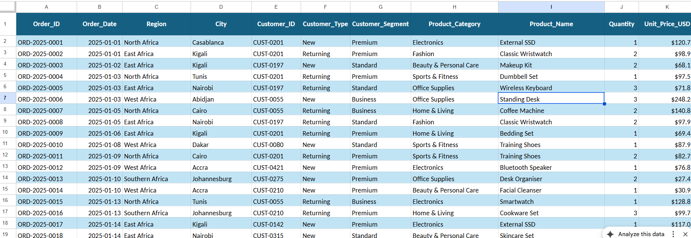
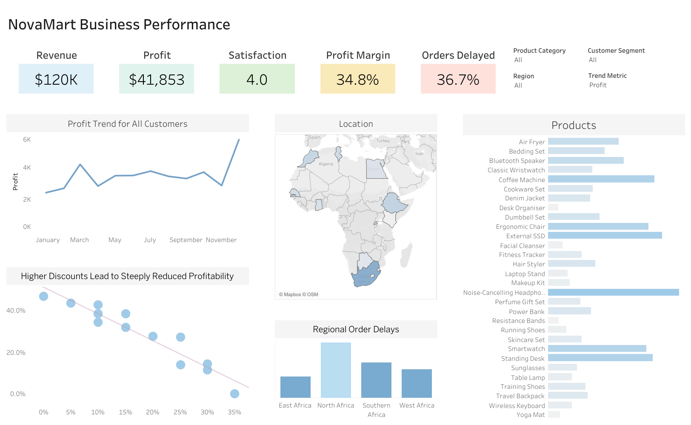
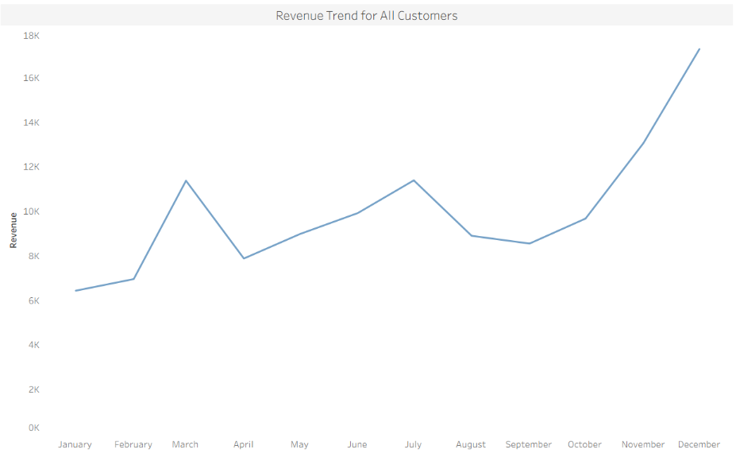
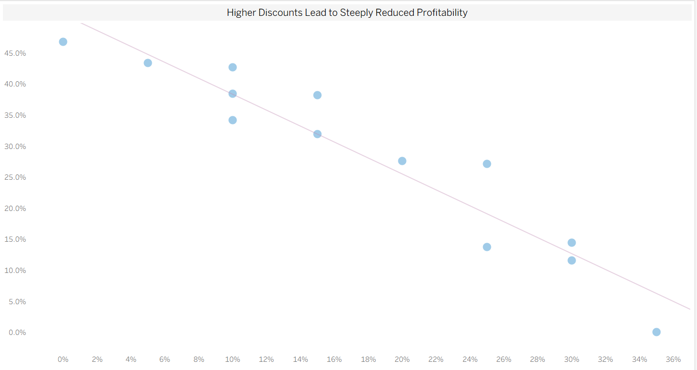
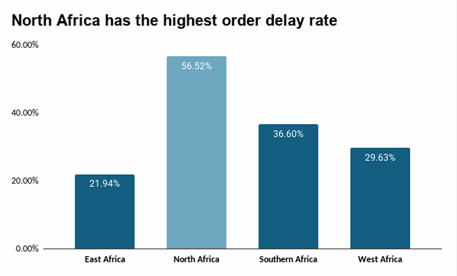

# 🛒 NovaMart Business Performance Analysis (2025)

## 📌 Project Background
NovaMart has experienced another year of revenue growth and continues to expand across East, West, North, and Southern Africa. While the headline numbers appear encouraging, executive leadership is concerned that several key business indicators are moving in conflicting directions. We are observing strong sales in certain areas alongside mixed signals in customer experience, profitability, operational performance, and marketing effectiveness.

This analysis evaluates four key business dimensions:
* **Trend Metric Analysis:** Evaluation of historical sales patterns globally and regionally, focusing on revenue, order volume, and profit margins.
* **Operational Performance:** Analysis of shipment methods, order delays, and product return rates.
* **Customer Experience:** Measurement of regional satisfaction scores, return-rate impacts, channel-specific acquisition of new customers, and repeat purchase behavior.
* **Regional Comparisons:** Comparative analysis of revenue, profit margin, returns, delays, and satisfaction across all operating regions.

🔗 **Interactive Tableau Dashboard:** [Link to Dashboard](https://public.tableau.com/app/profile/agnes.kabanga/viz/NovaMartBusinessPerformance/Dashboard1)  
📊 **Google Sheets Dataset:** [Link to Dataset](https://docs.google.com/spreadsheets/d/18VMhfBzjOac-XX4YAW0tJREhEWYqSf3MeNSTwkoxb9o/edit?usp=sharing)

---

## 📅 Dataset & Data Preparation
This dataset represents NovaMart's 2025 transactional operations across Africa, containing order details, delivery statuses, customer satisfaction scores, revenue, and profit metrics.

### Quality Control & Preprocessing
Prior to analysis, quality control checks were conducted using Excel functions to inspect data integrity, standardise values, and prepare fields for aggregation.

---

## 📈 Executive Summary

### Overview of Findings
NovaMart achieved **$120K in revenue** and **$41,853 in overall profit** this year with a **34.8% profit margin**. While performance remains strong with an overall **4.0 / 5.0 customer satisfaction score**, operational bottlenecks persist across regions—highlighted by a company-wide **36.7% order delay rate** that threatens long-term profitability and customer experience.

---

### Key Insights

#### 1. Trend & Profitability Metrics
* **Monthly Trends:** Revenue nearly tripled over the year, but profit only grew **~2.3x**, with margins compressing sharply in Q4 (December).

* **Product Profitability:** **Noise-Cancelling Headphones** generated the highest overall revenue but carried the highest average discount (**13%**) and lowest profit margin (**17.3%**). Conversely, **Power Banks** had the lowest discount (**10%**) and highest profit margin (**31.4%**).

| Product Name | Revenue (USD) | Profit (USD) | Avg. Discount (%) | Profit Margin (%) | Correlation |
| :--- | :---: | :---: | :---: | :---: | :---: |
| **Smartwatch** | $7,968.32 | $1,501.14 | 11% | 18.8% | -0.528 |
| **Power Bank** | $3,504.78 | $1,101.63 | 10% | 31.4% | - |
| **Noise-Cancelling Headphones** | $10,568.99 | $1,831.44 | 13% | 17.3% | - |
| **External SSD** | $9,183.59 | $1,862.97 | 12% | 20.3% | - |
| **Bluetooth Speaker** | $6,120.44 | $1,454.76 | 13% | 23.8% | - |
| **Total / Blended** | **$37,346.12** | **$7,751.94** | **12%** | **20.8%** | - |

* **Discount vs. Margin Correlation:** Scatter plot regression reveals an $R^2$ of **0.906**, indicating that discount levels explain **~91% of the variation in profit margin**. 

  * Margin falls from roughly **47% at 0% discount** down to nearly **0% at ~35% discount**.
  * Every 5-point increase in discount costs approximately **6–7 percentage points of profit margin**.

#### 2. Operational Performance
* **North Africa** generates the highest regional revenue (**$31.9K**), but suffers from a severely high order delay rate of **56.52%**.

#### 3. Customer Experience
* A stark satisfaction gap exists around product returns:
  * Customers **without returns** rated their experience **4.13 / 5.0**.
  * Customers **with returns** rated their experience at just **2.67 / 5.0** (a **1.46 point drop / 35% lower**).

| Return Status | Avg. Customer Satisfaction | Gap vs. Non-Return |
| :--- | :---: | :---: |
| **No Return** | 4.13 | - |
| **Returned Item** | 2.67 | -1.46 pts (-35%) |
| **Grand Total** | **4.02** | - |

---

## 💡 Recommendations

1. **Overhaul North Africa Logistics:** Audit fulfillment centers and third-party logistics (3PL) partners serving North Africa to reduce delay rates from 56.52% toward the 20–25% benchmark.
2. **Protect Margins While Growing Revenue:**
   * Cap promotional discounts at **~10–15%**. Past this threshold, profit margins collapse rapidly.
   * Track a **"Margin Floor" KPI** alongside revenue growth targets to avoid unprofitable sales volume.
3. **Root-Cause Product Returns:** Categorize return reasons (e.g., wrong item, damaged, late delivery, quality issues) to address specific root causes.
4. **Restructure Noise-Cancelling Headphones Promotions:** Shift average discounts from 13% down to 10% (matching Power Banks) to meaningfully lift total company profit given its heavy revenue weight.

---

## 🎯 Expected Business Impact

* **Q4 Profit Preservation:** Implementing disciplined discount caps during the Oct–Dec sales surge could preserve an estimated **10–15% more profit** during peak sales volume.
* **Sustainable Customer Growth:** Shifting from discount-led to service-led acquisition protects the 55% new customer base from early churn, improving long-term Customer Lifetime Value (LTV).
* **Margin Recovery:** A 5-point average discount reduction focused on high-discount items could lift blended margins from 20.8% to **~28%**, boosting total profit by **30–35%** without requiring additional revenue growth.
* **Risk Avoidance:** Addressing logistics bottlenecks prevents continued reliance on heavy discounting to offset customer dissatisfaction in high-growth regions like North Africa.
